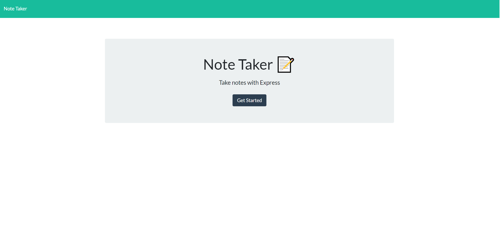
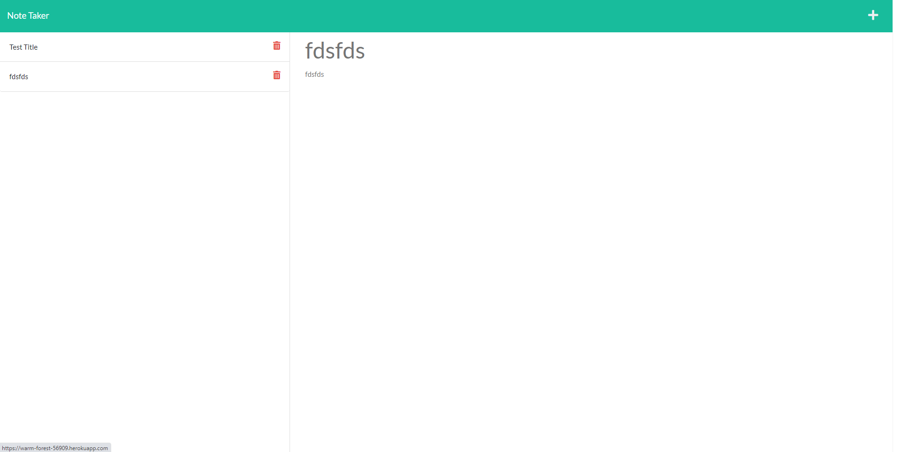

  # Challenge 11 Note Taker

  

  ## Table of Contents
  * [Return to Top](#)
  * [Application Description](#application-description)
  * [How to Use](#how-to-use)
  * [Application Built With](#application-built-with)
  * [Screenshot](#screenshot)
  * [Deployed Application](#deployed-application)
  * [Github Info](#github-info)
  * [Contact](#contact)
  
  ## Application Description
  This application was designed to allow users to take notes and save them to help with organization of tasks that need to be done. It is simple to use and will be under futher development. Currently the delete function does not work, this will come in the near fututre.
  
  
  ## How to Use
  To use the application: 
  * Navigate to the deployed link 
  * Click the plus in the top right corner
  * Input the info into the title and description fields
  * Press save icon in top right corner.
  
  

  ## Application Built With
  * HTML
  * CSS
  * JavaScript
  * Node.js
  * Express.js
  * UniqID
  
  ## Screenshot
  
  

  ## Deployed Application
  [https://warm-forest-56909.herokuapp.com/](https://warm-forest-56909.herokuapp.com/)

  

  ## Github Info
  Github Username: DSiedlarz90

  Github Profile Link: https://github.com/DSiedlarz90

  ## Contact
  If you have any questions or concerns please reach out at:

  [DSiedlarz90@gmail.com](mailto:DSiedlarz90@gmail.com)

  
  
  